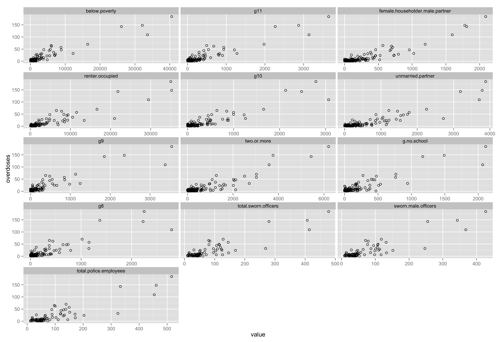

#ctnamecleaner, ctpopulator, ctcorrelator

-------

## ctnamecleaner

An R package that finds that takes a list of Connecticut hamlets or neighborhoods and adds a column with the matching official town names. 

- Matches hamlets or neighborhoods to equivalent town names
- Adds additional column with population
-  Optionally exports a new CSV file
-  Lists names that could not be matched to towns
-  Based on an [ever-growing list](https://docs.google.com/spreadsheets/d/1WqZIGk2AkHXKYvd4uXy5a2nwyg529e7mMU5610Ale0g/edit?usp=sharing) of town names that [TrendCT.org](http://www.trendct.org) comes across. 

####What function ctnamecleaner() does
Let's assume you have a dataframe in R called **towncoffeeshops** that looks like

Town | Coffeeshops
--- | ---:
Andover | 2
Centerbrook | 5
Yalesville | 1

*Run this in R*
```ssh
ctnamecleaner(Town, towncoffeeshops, filename="towncoffeecleaned", case="Upper")
```
You'll get a new file called **towncoffeecleaned.csv** that looks like

Town | Coffeeshops | real.town.name
--- | ---: | --- 
Andover | 2 | ANDOVER
Centerbrook | 5 | ESSEX
Yalesville | 1 | WALLINGFORD

*Alternatively*

```ssh
ctnamecleaner(Town, towncoffeeshops)
```
The command above will create a dataframe without exporting.

####Usage

```ssh
ctnamecleaner(name, data, filename="nope", case="Title")
```

####Arguments
- **name** - Column with town names
- **data** - Name of data frame. 
- **filename** Name of CSV to save. If skipped, CSV will not export.
- **case** Output of town string. Options are **Upper**, **Lower**, and **Title**

-------

## ctpopulator

An R package that appends the most-recent population of Connecticut towns to a dataframe for efficient per-capita calculations. 

- Matches 2013 town population to equivalent town names
- Adds additional column with population
-  Optionally exports a new CSV file
-  Works best if the dataframe has originally been checked with *ctnamecleaner()*

####What function ctpopulator() does
Let's assume you've collapsed duplicate town names column **real.town.name** in the **CTNAMECLEANED** dataframe above and summed up or averaged the figures you were working with. 

*Run this in R*
```ssh
ctpopulator(real.town.name, CTNAMECLEANED, filename="towncoffeepop")
```
You'll get a new file called **towncoffeepop.csv** that looks like the table below. *Note:* if you exclude the CSV **filename** parameter only the dataframe will be exported and can be assigned to an object. 

Town | Coffeeshops | real.town.name | pop2013
--- | ---: | --- | ---:
Andover | 2 | ANDOVER | 3095
Centerbrook | 5 | ESSEX | 6668
Yalesville | 1 | WALLINGFORD | 45112

####Usage

```ssh
ctnamecleaner(name, data, filename="nope")
```

####Arguments
- **name** - Column with town names
- **data** - Name of data frame. 
- **filename** Name of CSV to save. If skipped, CSV will not export.
- **case** Output of town string. Options are **Upper**, **Lower**, and **Title**


-------

## ctcorrelator

An R package that takes a town dataframe and checks for correlations between the original data set and 500 different variables including demographics, median income, education attainment, and poverty from an [ever-growing list](https://docs.google.com/a/trendct.org/spreadsheets/d/1TMN4Di8O7ROUDgylb7IvtnfNtblbwoHy-dpgId6FT3E/edit?usp=sharing). **Why?** Correlation does not mean causation. But having a quickly generated list could help point a researcher of journalist into unforseen directions with respect to the original data.

- Appends the original dataframe with ~500 other variables from ~20 spreadsheets
- Determines the Pearson product-moment correlation coefficient for each variable as compared to the original data
- Notifies the users which variables had the strongest correlations by exporting tables and charts to browse
-  Exports a summary shreadsheet
_  Exports a dataframe of the variables with strong correlations for analysis later
_  Exports small-multiple scatterplots based on user-set coefficient threshold
-  Works best if the dataframe has originally been checked with *ctnamecleaner()*

####What function ctcorrelator() does
Let's assume you've collapsed duplicate town names column **real.town.name** in the **CTNAMECLEANED** dataframe above and summed up or averaged the figures you were working with. 

This is a dataframe called *ctcoffeeshops*.

Town | Coffeeshops 
--- | ---: 
Andover | 2 
Essex | 5 
Wallingford | 1 

*Run this in R*
```ssh
ctcorrelator(ctcoffeeshops, p=.9)
```

You'll get a new file called **array_summary.csv** that looks similar to this:

row | correlation	| n()
--- | --- | ---:
1	| moderate.negative.correlation	| 7
2	| moderate.positive.correlation	| 70
3	| no.correlation	| 12
4	| strong.negative.correlation	| 3
5	| strong.positive.correlation	| 103
6	| very.strong.positive.correlation	| 8
7	| weak.negative.correlation	| 6
8	| weak.positive.correlation	| 49

You'll get a new file called **strong.very.strong.csv** that looks similar to this:

row	| column.abbrev	| corre	| correlation	| raw	| column.name
--- | --- | --- | --- | --- | ---
1	| below.poverty	| 0.947982822	| very.strong.positive.correlation	| 0.947982822	| Below poverty
2	| g11	| 0.934302408	| very.strong.positive.correlation	| 0.934302408	| Educational Attainment for the Population 25 Years and Over, 11th grade (City)
3	| female.householder.male.partner	| 0.931860863	| very.strong.positive.correlation	| 0.931860863	| Unmarried-partner Households by Sex of Partner, Female householder and male partner (City)

And then you'll also get a new file called **plot.png** that looks similar to 



####Usage

```ssh
ctcorrelator(dat_data, p=.9)
```

####Arguments
- **dat_data** - dataframe with two columns: *town* with CT town names and one other one with raw numbers representing whatever you need.
- **p** - The minimum threshold for the correlation coefficient that will be rendered in the charts. 

-------

####What you'll need to start
  - [R](http://www.r-project.org/)
  - [RStudio](http://www.rstudio.com/) (not really, but sure)

####What to run within R or RStudio
Assuming user is starting from scratch
```ssh
install.packages("devtools")
library(devtools)

install_github("trendct/ctnamecleaner")
library(ctnamecleaner)
```

### Future versions
Will account for zip codes and census tracts or possibly blocks in Connecticut.

### Version
0.3.1

MIT